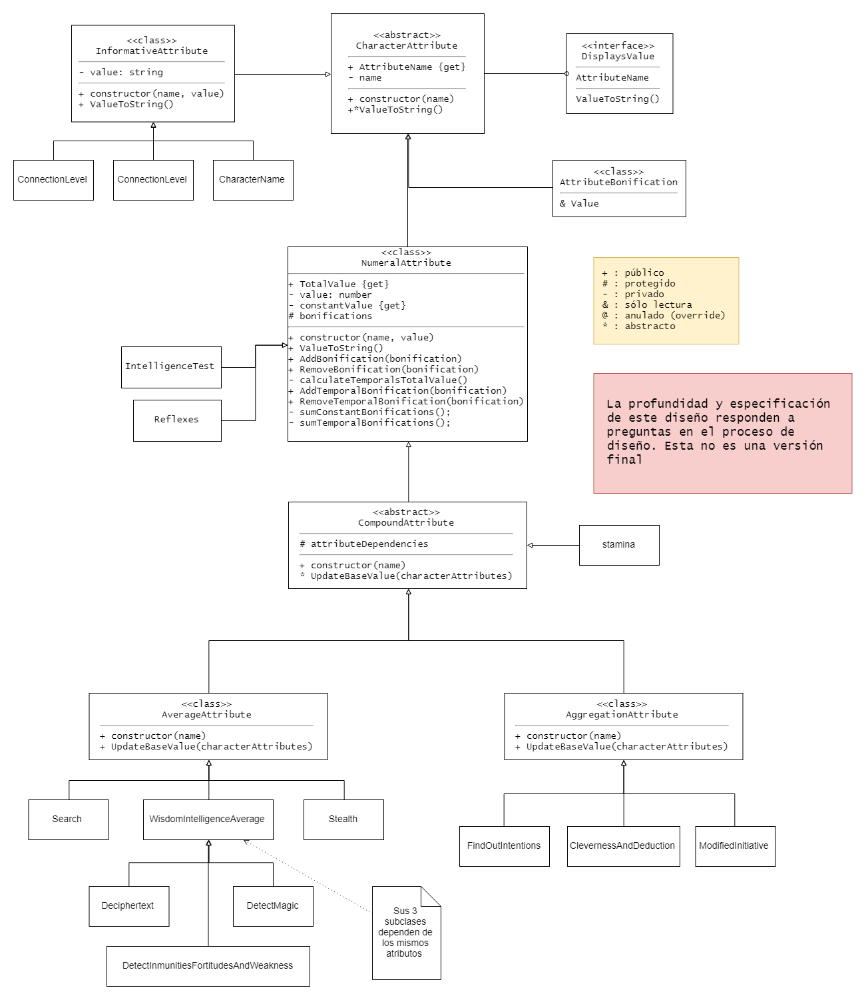

# Atributos del personaje

Este directorio contiene las clases necesarias para definir los atributos de un personaje. Son puramente conceptuales y para apoyar el proceso de diseño

## Modelo actual:

[Copia el modelo](https://www.draw.io/?lightbox=1&highlight=0000ff&edit=_blank&layers=1&nav=1&title=Atributos.html#Uhttps%3A%2F%2Fdrive.google.com%2Fuc%3Fid%3D1QZInoo-M7Gy3aGkzlxM-a4xUsPYRrOs2%26export%3Ddownload)